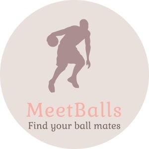

# MeetBalls 🏀

Welcome to our new generation social network!
'MeetBalls' is a web application that is aimed at helping people finding partners,
groups and events for ball games.

## Built With

* [Python](https://www.python.org/) - Python is an interpreted, high-level, general-purpose programming language
* [Vagrant](https://www.vagrantup.com/) - Vagrant is a tool for building and managing virtual machine environments in a
  single workflow
* [Virtual-Box](https://www.virtualbox.org/) - VirtualBox is a powerful x86 and AMD64/Intel64 virtualization product for
  enterprise as well as home use

## Team members

* [Amit Cohen] (https://github.com/amitCohen2)
* [Maayan Mashhadi] (https://github.com/MaayanMashhadi)
* [Zvi Naor Cohen] (https://github.com/ZvikaNaorCohen)
* [Daniel Sionov] (https://github.com/Danielsio)
* [Ohad Segal] (https://github.com/OhadSeg)
* [Amit Kaplansky] (https://github.com/amitKaplansky)
* [Idan Zimilis] (https://github.com/IdanZimi)

## Contribute

In order to contribute, please refer to the contributing guide below.
* [CONTRIBUTING](CONTRIBUTING.md)

## License

This project is licensed under the MIT License - see the [LICENSE](LICENSE) file for details

